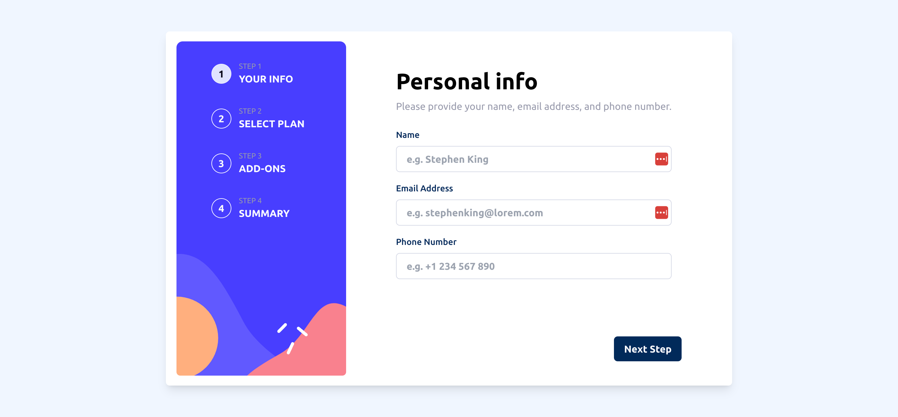

# Frontend Mentor - Multi-step form solution

This is a solution to the [Multi-step form challenge on Frontend Mentor](https://www.frontendmentor.io/challenges/multistep-form-YVAnSdqQBJ). Frontend Mentor challenges help you improve your coding skills by building realistic projects.

## Table of contents

-   [Getting it running](#starting)
-   [Overview](#overview)
    -   [The challenge](#the-challenge)
    -   [Screenshot](#screenshot)
    -   [Links](#links)
-   [My process](#my-process)
    -   [Built with](#built-with)
    -   [What I learned](#what-i-learned)
    -   [Continued development](#continued-development)
    -   [Useful resources](#useful-resources)
-   [Author](#author)
-   [Acknowledgments](#acknowledgments)

## Getting it running

To get this project running locally, you need to have [Node.js](https://nodejs.org/en/) installed on your machine. Once you have Node.js installed, you can clone this repository and run the following commands in the root directory of the project:

To install all dependencies:
```bash
npm install
```

To start the development server:
```bash
npm run start
```

To build the project:
```bash
npm run build
```
Default port is 3000 and default build folder is dist.

## Overview

### The challenge

Users should be able to:

-   Complete each step of the sequence
-   Go back to a previous step to update their selections
-   See a summary of their selections on the final step and confirm their order
-   View the optimal layout for the interface depending on their device's screen size
-   See hover and focus states for all interactive elements on the page
-   Receive form validation messages if:
    -   A field has been missed
    -   The email address is not formatted correctly
    -   A step is submitted, but no selection has been made

### Screenshot



### Links

-   Solution URL: [Github repo](https://github.com/Robertron624/multi-step-form)
-   Live Site URL: [Netlify URL](https://capable-bubblegum-235e56.netlify.app/)

## My process

### Built with

-   Semantic HTML5 markup
-   CSS custom properties
-   Flexbox
-   CSS Grid
-   Mobile-first workflow
-   [React](https://reactjs.org/) - JS library
-   [TailwindCSS](https://tailwindcss.com/) - For styles
-   [React Hook Form](https://react-hook-form.com/) - For form validation
-   [React Context](https://reactjs.org/docs/context.html) - For state management
-   [React Router](https://reactrouter.com/) - For routing

### What I learned

With this project I learned how to use React Hook Form and React Context to manage the state of a multi-step form. I also learned how to use React Router to navigate between the different steps of the form, in fact the numbers steps also benefits from this. React Hook Form was a great and easy way to validate users input.
Most of the styling was done with TailwindCSS, but I also used some custom css for the steps numbers and the custom checkboxes.

The steps numbers
```tsx
        <div className="w-full md:max-w-[17rem] h-40 md:h-full bg-no-repeat bg-steps-pattern-mobile md:bg-steps-pattern-desktop bg-cover md:rounded-md">
            <div className="flex md:flex-col gap-5 md:gap-8 max-w-[12rem] md:max-w-none items-center mx-auto py-8 ">
                {FORM_STEPS.map((stepNumber) => (
                    <div className="md:flex items-center md:w-40 gap-3" key={stepNumber.label}>
                        <button
                            onClick={handleChangeStep}
                            className={`${
                                currentStep == stepNumber.label
                                    ? "bg-magnolia opacity-90 text-black"
                                    : "bg-transparent text-slate-50"
                            } font-semibold w-8 h-8  border border-white rounded-full flex justify-center items-center`}
                            id={`${stepNumber.label}`}
                        >
                            <div>{stepNumber.label}</div>
                        </button>
                        <div className="hidden md:inline-block text-left">
                            <p className="text-cool-gray text-xs">
                                STEP {stepNumber.label}
                            </p>
                            <p className="font-bold text-base text-alabaster uppercase">
                                {stepNumber.description}
                            </p>
                        </div>
                    </div>
                ))}
            </div>
        </div>
```

The creation of the global state and its getter and setter
```ts
export function AppProvider({ children }: AppStateProviderProps) {
    // value is an array with two elements: [state, setState]

    const value = useState<AppState>({
        name: "",
        email: "",
        phone: "",
        plan: defaultPlan,
        period: "monthly",
        addons: [],
    });

    return (
        <AppStateContext.Provider value={value}>
            {children}
        </AppStateContext.Provider>
    );
}

import { useContext } from "react";

// eslint-disable-next-line react-refresh/only-export-components
export function useAppState() {
    const context = useContext(AppStateContext);
    if (context === undefined) {
        throw new Error("useAppState must be used within the AppStateProvider");
    }
    return context;
```

### Continued development

This was the last free advanced challenge on Frontend Mentor, so I will be moving on to the premium challenges. I will continue to use React Hook Form and React Context to manage the state of my forms. I will also continue to use TailwindCSS (and some custom css) for styling since it greatly improves my styling productivity. I will also continue to use React Router for routing.
I also want to start using other none React libraries like Angular, Svelte and Vue.

### Useful resources

-   [Build a Multistep Form With React Hook Form](https://claritydev.net/blog/build-a-multistep-form-with-react-hook-form) - This helped me gettting started with React Hook Form and multistep forms. I really liked this pattern of using React Context to manage the state of the form. It's a bit more complex than using a state management library like Redux, but it's a good way to learn how to use React Context.

-   [How TO - Custom Checkbox
](https://www.w3schools.com/howto/howto_css_custom_checkbox.asp) - Great article and easy to follow on how to create custom checkboxes.

## Author

- Personal Website - [Robert Ramirez](https://robert-ramirez.netlify.app)
- Frontend Mentor User- [@Robertron624](https://www.frontendmentor.io/profile/Robertron624)
- Twitter - [@robertdowny](https://www.twitter.com/robertdowny)
